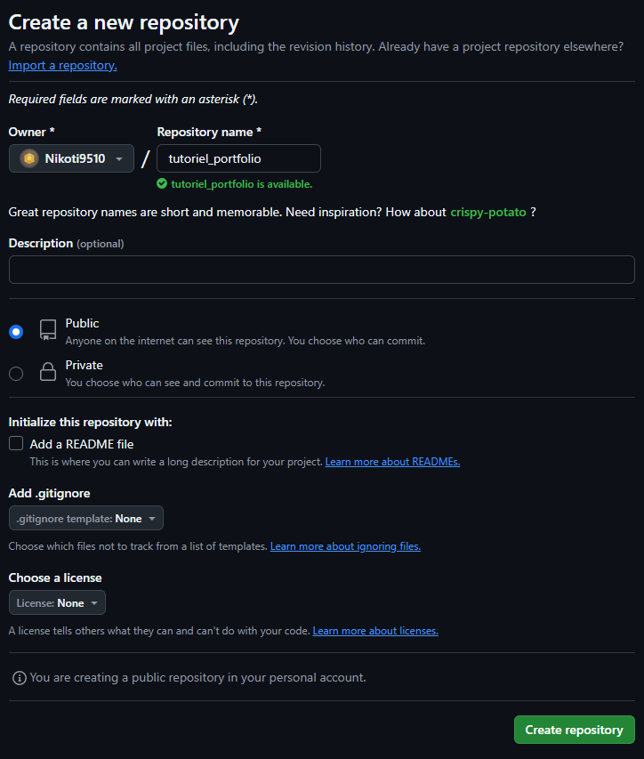
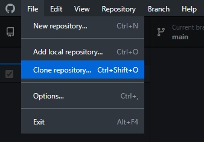
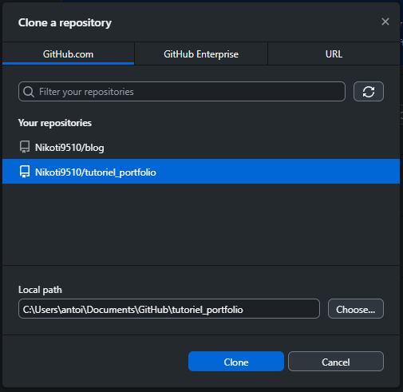
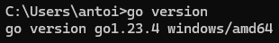
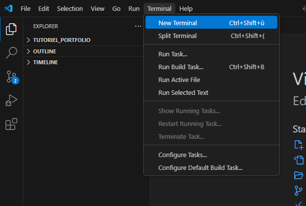
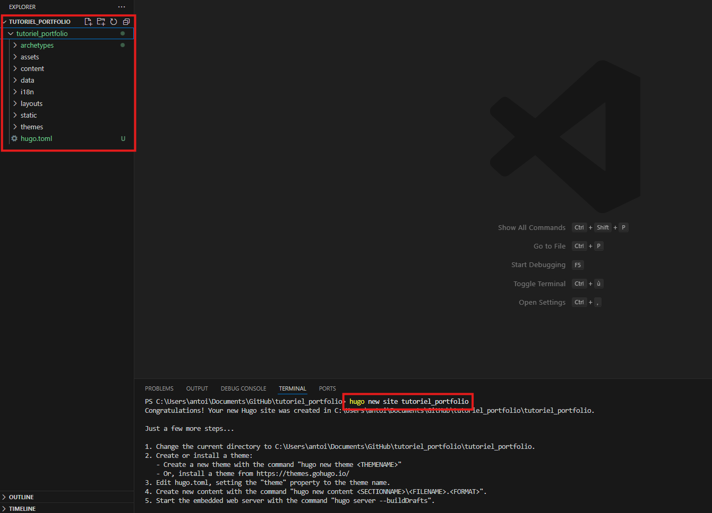
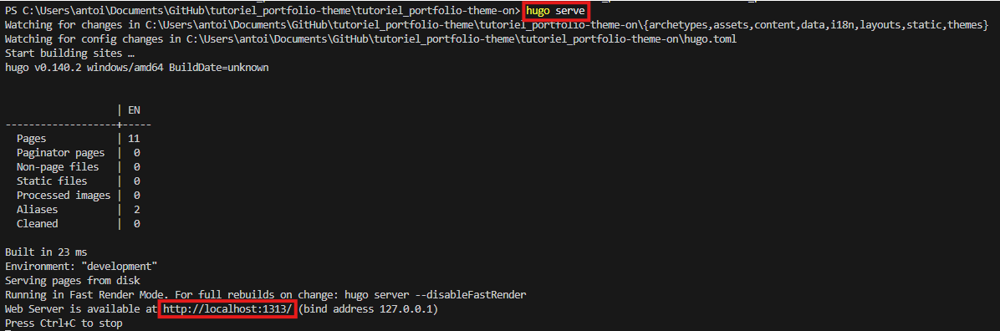

# Créer un portfolio avec Hugo et Netlify - Partie 1

Pour aider mes <u>*collègues*</u> à construire leurs portfolio, j'ai écris ce tutoriel afin de découvrir le concept de la JAMstack.

On parle de JamStack pour décrire un site ou une application créée en combinant différentes API et outils afin de servir un site statique, c'est-à-dire en HTML brut, sans calcul supplémentaire côté serveur ou client. Le but étant de garantir des performances et une expérience utilisateur optimales. Avec cette approche, les éléments dynamiques d'un site sont générés en amonts, puis mis à disposition sur un serveur.

Cela permet également de prendre avantage de divers outils et logiciels (gratuits, libres de droits, payants, avec abonnement, etc..) et de les assembler pour bénéficier de leurs avantages (et ne pas réinventer la roue à chaque contrainte). Par exemple, plutôt que de gérer manuellement l'hébergement de notre site, on utilise un outil comme Netlify qui le fait pour nous. L'idée, c'est de ne pas perdre de temps sur des fonctionnalités déjà existantes, et de se concentrer sur le design et le contenu de notre site.

Dans ce tutoriel, nous allons donc créer une structure de base pour un Portfolio web mettant un place une page d'accueil, une page contact et une liste de projet. Pour cela, nous allons utiliser les outils suivants : 
* [Github Desktop](https://desktop.github.com/download/) pour gérer facilement notre projet en créant des sauvegardes et différentes versions, tout en stockant notre projet en ligne. (J'utilise la version desktop mais libre de faire autrement si vous le préférez).
* [Visual Studio Code](https://code.visualstudio.com/) pour notre éditeur de code. Il nous permet de faire le lien avec Github et Hugo. Il est tout à fait possible d'en utiliser un autre, mais pour ma part c'est celui que je trouve le plus pratique.
* [Hugo](https://gohugo.io/), un framework ultra rapide et open source, qui nous permet de simplifier la construction d'un site web optimisé, avec des options de templating nous permettant de facilité la maintenabilité et les modifications du site.
* [Netlify](https://www.netlify.com/), qui fait le lien avec notre répertoire Github où est stocké notre projet, pour le transformer en site internet disponible en ligne. 

Ce tutoriel va être découpé en plusieurs partie, dans lesquels nous allons aborder des sujets suivants :
1. la mise en place du projet et l'installation d'HUGO,
2. la construction du site,
3. la création des projets,
4. la mise en ligne du site sur Netlify,
5. l'optimisation et l'intégration des render-hooks.

---

## Mise en place du projet

Une fois Github Desktop et Visual Studio Code installé, nous allons pouvoir mettre en place le projet. Commençons par nous rendre dans notre [espace personnel sur GitHub](https://github.com/) et créons un nouveau répertoire, en cliquant sur le bouton `New` en haut à gauche.


Donnons un nom à notre répertoire, par exemple "*tutoriel_portfolio*", et validons en cliquant sur `Create repository` en bas à droite. (les autres options peuvent être laissées par défaut). 





Si on retourne dans notre dashboard, on voit que notre nouveau répertoire a bien été créé. 


Maintenant, rendons nous dans Github Desktop. Si ce n'est pas déjà fait, connectez l'application à votre compte Github. Ensuite, il nous est possible de cloner notre répertoire, afin de pouvoir travailler localement sur votre machine. En haut à gauche, cliquez sur `File > Clone repository`.





Choisissez le répertoire que nous venons de créer et cliquez sur `Clone` en bas de la fenêtre. 





Une fois le répertoire cloné, on retrouve notre espace de travail en haut à gauche, et il est possible de passer d'un projet à un autre si besoin. Nous pouvons maintenant ouvrir notre projet dans VScode en cliquant dans le bouton `Open in Visual Studio Code` au centre de l'écran.


Et voilà, nous sommes prêt à travailler ! On pourrait s'arrêter là et faire un site internet statique en créant des pages HTML, en les personnalisant en CSS et en ajoutant de l'interaction en Javascript. Mais pour nous faciliter la tache, nous allons installer Hugo.


***Avant de continuer, fermez GitHub Desktop et Visual Studio Code.***

---

## Installation de Go, Hugo et Git


Avant de pouvoir installer Hugo, il faut s'assurer que Git et GO soient installés et fonctionnels sur notre machine. 


### Installer Git

Rendez-vous sur le [site de Git](https://git-scm.com/downloads) et cliquez sur l'option correspondant à votre système d'exploitation. Téléchargez la dernière version, puis une fois le téléchargement terminé, lancez l'exécutable et suivez les instructions.

### Installer GO

Pour installer [Go](https://go.dev/doc/install), le langage de programmation qu'utilise Hugo, téléchargez l'exécutable pour votre système d'exploitation et suivez les instructions de l'installateur. 

Une fois l'installation terminée, ouvrez une invite de commande (Windows + R et sélectionnez `cmd` ou cliquez sur le menu démarrer et cherchez `cmd`). Saisissez dans la console la ligne `Go version` pour vérifier que l'installation est bien réussie. 

> Il est possible qu'un redémarrage de votre ordinateur soit nécessaire pour finaliser l'installation. Sur Windows, lancez l'invite de commande en tant qu'administrateur.



### Installer Hugo

Rendez vous sur [gohugo.io/installation](https://gohugo.io/installation/) et cliquez sur l'option correspondant à votre système d'exploitation. Nous voulons installer la version étendue d'Hugo (nécessaire pour accéder à certaines fonctionnalités). Pour Windows, copiez dans l'invite de commande la ligne suivante : 

```shell
CGO_ENABLED=1 go install -tags extended github.com/gohugoio/hugo@latest
```

> Sur *Mac* ou *Linux*, il faudra aller chercher la commande correspondante sur le site de *gohugo*.

---


## Création du site avec Hugo


Une fois les installations terminées, nous allons pouvoir commencer à créer notre site. Pour cela, réouvrons GitHub Desktop et notre projet dans VSCode. Commençons par ouvrir un nouveau terminal de commande, dans `Terminal > New Terminal`.





Dans ce terminal, vous pouvez maintenant générer votre site avec Hugo. Il suffit d'exécuter la commande suivante : 

```shell
Hugo new site NOM_DU_SITE
```

Remplacez `NOM_DU_SITE` par le nom de votre choix (sans espaces ni caractères spéciaux).



Une fois la commande exécutée, la création du site est terminé. Des dossiers et fichiers ont étés ajoutés dans le projet par Hugo. À partir de là, deux choix s'offrent à nous. 

1. Installer un thème compatible avec Hugo. 
2. Continuer notre projet en partant de zéro. 

Pour ce tutoriel et dans un souci d'exhaustivité, nous allons voir comment installer un thème. Mais nous continuerons dans les prochaines parties notre Portfolio sans partir d'un thème, afin de n'utiliser que ce qui nous est nécessaire et pour comprendre au mieux le fonctionnement d'Hugo.

---

## Installer un thème


Hugo propose une [collection de thème gratuit sur son site](https://themes.gohugo.io/), et il est également possible d'en trouver des plus complets sur d'autres sites, comme par exemple [gethugothemes.com](https://gethugothemes.com/products) ou [anvodstudio.com](https://anvodstudio.com/hugo-themes/). Prenons le thème [PaperMod](https://themes.gohugo.io/themes/hugo-papermod/). Pour l'installer, rien de compliqué, il faut se rendre sur la page Github du thème (en cliquant sur le bouton "Download") et d'exécuter la commande fournie dans le terminal de VScode. Pour PaperMod, voilà la commande : 

```shell
git submodule add --depth=1 https://github.com/adityatelange/hugo-PaperMod.git themes/PaperMod
```


> Il faut s'assurer que nous nous trouvons à la racine de notre projet avant d'exécuter la commande. Dans le terminal, le chemin devrait être "GitHub\Nom_du_repertoire". Si ce n'est pas le cas, il faut s'y rendre. Utilisez `cd Nom_du_dossier` vous permet de vous déplacer dans un dossier. Utilisez `ls` vous permet de lister tous les dossiers et fichiers présents dans le dossier actuel. Utilisez `cd ..` vous permet de remonter un niveau. 


Une fois la commande lancé et le thème téléchargé, il ne nous reste plus qu'a indiquer à Hugo que nous souhaitons utiliser ce thème. Pour cela, rendez-vous dans le fichier de configuration `config.toml` (ou `hugo.toml`, les deux fonctionnent et peuvent être présents) et ajoutez la ligne suivante dans le fichier : 

```toml
theme = ["PaperMod"]
```


Et voilà ! Le template est chargé, il ne nous reste plus qu'à lancer un serveur de test pour le prévisualiser.


### Lancer un serveur de test

Hugo nous permet de tester notre travail via un serveur local. Pour cela, il faut exécuter la commande suivant dans le terminal de VScode (toujours à la racine du projet) : 

```shell
hugo serve
```

Une fois le serveur lancé, cliquez sur le lien que vous donne Hugo pour visualiser votre site. Pour stopper le serveur de test, il faut utiliser le raccourci clavier `Ctrl+C` dans l'invite du terminal.




---

En résumé, dans cette première partie, nous avons vu en quoi consiste la JAMstack, nous avons mis notre projet en place dans Github, nous avons installé Hugo (ainsi que Go et Git) et nous avons créé notre site en lui installant un thème pré-existant. Il est tout à fait possible de s'arrêter là et de continuer avec ce thème. Mais pour les prochaines parties du tutoriel, nous reprendrons à l'étape précédent l'installation du thème. 

Dans la [partie suivante](), nous allons regarder plus en détail comment fonctionne Hugo et mettre en place la structure de notre Portfolio.