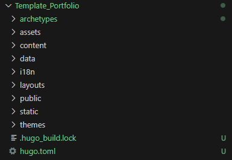
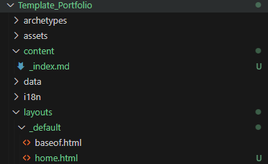
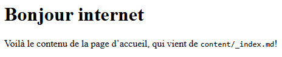
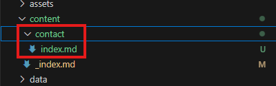

# Créer un portfolio avec Hugo et Netlify - Partie 2

Dans cette partie, nous allons créer la structure de base pour notre site. Nous allons commencer par créer une page d'accueil, avec un header, du contenu et un footer. Cela va nous permettre de prendre en main le fonctionnement de Hugo, en particulier le système de *Partials*. Nous aborderons enfin la création et l'ajout d'un menu de navigation.

---

## Structure d'un site Hugo

Regardons la structure généré par Hugo lors de la création du site d'un peu plus près. 



Pour le moment, il y a trois dossiers qui nous intéresses :


1. **static** : C'est ici que son stocké les ressources utiles au site qui ne changent jamais, tels que les images réutilisées dans toutes les pages, les fichiers CSS et Javascripts, etc.
2. **content** : Dans ce dossier, on retrouve les pages de contenus, en format `.md` (pour [Markdown](https://www.markdownguide.org/cheat-sheet/))
3. **layouts** : Où son stocké les pages de templates en format `.HTML`, ainsi que les fameuses *Partials*. 


> Pour plus de détails sur la structure de Hugo, consultez la documentation à ce sujet : [gohugo.io/getting-started/directory-structure/#directories](https://gohugo.io/getting-started/directory-structure/#directories)


Pour que notre site puisse fonctionner, il y quelques étapes à suivre : 


1. Créez un dossier `_default` dans `layouts`.

2. Dans `_default`, créez un fichier `home.html` avec le contenu suivant :
   ```go-template
   {{ define "main" }}
       {{ .Content }}
   {{ end }}
   ```

3. Toujours dans `layouts > _default`, créez un fichier `baseof.html` avec le contenu suivant :
    ```go-template
     <html lang="{{ site.Language }}">
     <body>
       <main>
         {{ block "main" . }}{{ end }}
       </main>
     </body>
     </html>
   ```

4. Enfin, dans le dossier `content`, ajoutez un fichier `_index.md` avec le contenu suivant : 
    ```markdown
    ---
    title: "Page d'accueil"
    ---
    
    # Bonjour internet
    Voilà le contenu de la page d'accueil, qui vient de `content/_index.md`!
    ```


Voilà à quoi ressemble la structure après la création.





Si vous lancez le serveur de test (`Hugo serve`), notre page s'affiche ! 





Expliquons ce que l'on vient de faire : 


Nous avons créé un fichier `home.html` qui correspond à notre page d'accueil, et nous l'avons ajouté dans le dossier `layouts > _default` afin que Hugo le trouve. Dans ce fichier, on défini un bloc que l'on nomme `main`, dans lequel on ajoute le contenu de la page, `Content`. Ce contenu est récupéré automatiquement par Hugo dans le fichier `_index.md`, si celui-ci existe dans le dossier content.

Nous avons ensuite défini dans notre dossier `_defaut` le template de page pour toutes les pages du site, qui se nomme `baseof.html`. C'est cette page qui est toujours utilisé par Hugo pour assembler nos pages (il est possible d'en définir plusieurs en cas de besoin, voir [gohugo.io/templates/lookup-order](https://gohugo.io/templates/lookup-order/)). Pour le moment, notre fichier `baseof.html` est très simple, mais nous l'enrichirons plus tard. `home.html` se base sur ce template, et pour le moment ne fait rien de plus.  

Enfin, nous avons créé le fichier Markdown `_index.md`, c'est à dire le fichier de contenu, pour notre page d'accueil. Il est ajouté dans le dossier `content`, pour que Hugo puisse le retrouver et l'injecter dans la page. 


Avant d'aller plus loin, sauvegardons notre travail sur Github. 

---

## Pousser des fichiers locaux sur Github

Si nous nous rendons dans GitHub Desktop, plusieurs fichiers ont étés ajoutés dans la liste des modifications. Pour les envoyer sur votre répertoire Github, il faut donner un nom à notre *Commit*. Quelques choses comme "*Premier push*" fera l'affaire pour le moment. Vous pouvez également ajouter une description plus détaillé. Essayez d'être clair et précis dans vos noms de push, car vous pourrez les retrouver dans Github et revenir en arrière quand des bugs vont inévitablement apparaitre.  


Cliquez ensuite sur `Commit to main` en bas de la fenêtre. Il ne reste plus qu'a publier le *Commit* sur le projet, pour cela, cliquez sur `Publish branch`. 


Une fois cela fait et le chargement effectué, vous pouvez voir les fichiers dans votre espace GitHub en ligne. 


Améliorons maintenant notre site.

---

## Présentation des Partials

Les partials sont des extraits de code indépendants pouvant être injectés dans plusieurs parties d'un site. Ils fonctionnent comme des composants ou des sections, et permettent d'éviter de répéter le même code à différents endroits. Pour plus de détail, vous pouvez consulter la [documentation des partials](https://gohugo.io/templates/types/#partial) sur le site d'Hugo.

Dans notre template par défaut `baseof.html`, ajoutons le code suivant : 

```go-template
<html lang="{{ site.Language }}">
<head>
  {{ partial "head.html" . }}
</head>
<body>
  <main>
    {{ block "main" . }}{{ end }}
  </main>
  <footer>
    {{ partial "footer.html" . }}
  </footer>
</body>
</html>
```

Nous avons ajouté dans notre template deux partials, `head.html` et `footer.html`. La syntaxe est toujours : 

```go-template
{{ partials "chemin/du/partial.html" . }}
```

> Concernant le `.` que l'on ajoute après le chemin (et que l'on remarque aussi dans l'appel du bloc `main`), il représente le contexte. On ne rentre pas dans les détails ici, mais il est indispensable au bon fonctionnement du partial. Plus d'info sur la [documentation du contexte](https://gohugo.io/templates/introduction/#context).

Il faut maintenant créer les fichiers pour que Hugo puisse les charger. Pour cela, ajoutez un dossier `partials` dans le dossier `layouts`. Vous pouvez ajouter vos deux partials ici afin d'obtenir la structure suivante : 


Dans un partial, il faut uniquement inclure les éléments nécessaire à son fonctionnement. par exemple, créons un `footer` très simple : 

```html
<p>Le footer de mon site - 2025</p>
```

Pour notre `head`, ajoutons un tout petit peu plus de contenu : 

```html
<meta name="viewport" content="width=device-width, initial-scale=1.0">
<title>{{ .Title }}</title>
<link rel="stylesheet" href="/css/style.css">
```

Dans la balise `title`, nous faisons référence au titre de la page active, en faisant appel au contexte (avec le symbole `.`) de la page. La valeur de ce titre est récupéré dans le fichier Markdown correspondant. (S'il n'y a pas de fichier .md qui correspond, Hugo récupère un [titre en fonction du type de page](https://gohugo.io/methods/page/title/#article)). Le titre changera donc en fonction de la page dans laquelle on se trouve. 

Nous avons également ajouté un lien vers un fichier CSS. Celui-ci doit être ajouté dans le dossier `static` de notre projet (dans cette exemple, on a donc `static > css > style.css`). 

> Le contenu de ce dossier est chargé tel quel lors de la construction du site, mais le dossier lui n'est pas ajouté ! Il ne faut donc pas l'inclure dans le chemin `href="/static/css/style.css"` mais `href="/css/style.css"` (j'ai perdu quelques cheveux à comprendre ça). 

Avec un peu de CSS et nos deux partials, le site prend un peu forme.


Vous pouvez faire un nouveau *Commit* pour sauvegarder votre travail. Pensez à le faire de temps à temps, une fois que vous avez ajouté des fichiers ou modifiés du contenu de manière significative.

---

## Ajouter des pages

Pour ajouter une nouvelle page dans notre site, nous allons créer un dossier dans `content` avec le nom que l'on souhaite donner à celle-ci. Si l'on veut créer une page *Contact*, il faut donc ajouter le dossier `contact`. Dans ce nouveau dossier, il faut également un fichier `index.md` (sans underscore). Notre structure ressemble à ceci : 




> Pour comprendre pourquoi il faut parfois un `_` devant les fichiers `index`, vous pouvez consulter la documentation d'[Hugo à propos de l'organisation des pages](https://gohugo.io/content-management/page-bundles/). Mais pour faire simple, si une page a des descendants, c'est une *branche* et il faut un `_` au fichier `_index.md`. Si la page n'a pas de descendant, alors c'est une *feuille* et elle ne prend pas d'underscore pour son fichier `index.md`.

Créer cette page va nous permettre de définir un contenu différent de notre page d'accueil, mais elle est toujours construite à partir de notre template `baseof.html`. Nous pouvons également lui ajouter des éléments statiques différents et unique à cette page. Dans `contact.html`, ajoutez le code suivant :

```html
{{ define "main" }}
    {{ .Content }}
    <form action="#">
        <input type="text" value="Votre message">
        <input type="submit" value="Envoyer">
    </form>
    <a class="btn" href='/'>Retour à l'accueil</a>
{{ end }}
```

À la suite de notre injection de contenu via `{{ .Content }}`, nous avons ajouté un petit formulaire de contact et un lien vers la page d'accueil. Le lien vers l'accueil est fait via un chemin en "dur" avec `href='/'`. Mais Hugo mais a disposition plusieurs moyen d'[accéder à l'adresse d'une page](https://gohugo.io/functions/urls/), les plus utiles étant `relref` pour les chemins relatifs et `ref` pour les chemins absolus.

> Ce formulaire pourrait typiquement être ajouté en passant par un partial. Ainsi, nous pourrions le réutiliser ailleurs dans notre site très facilement.

Il faut enfin ajouter du contenu à notre page, en passant par le fichier markdown correspondant dans le dossiers `content > contact`, c'est à dire avec le même nom que notre nouvelle page. Voilà un exemple de contenu : 

```markdown
---
title: "Page d'accueil"
layout: "contact"
url: "/contact/"
---

# Discutons ensemble :smile:
Je suis à votre écoute pour réaliser votre projet !
```

C'est le bon moment pour introduire le fonctionnement des fichiers `Markdown`. Vous l'avez sans doute remarqué plus haut, nous avons ajouté du contenu entre des blocs `---` en haut de nos fichiers `.md`. C'est le contenu [Frontmatter](https://frontmatter.codes/docs) de notre page. Il nous permet de définir toute une collection d'information relative à la page, et que l'on peut récupérer dans les fichiers de templating. Nous reviendrons plus en détail sur cette partie plus tard, quand nous aborderons la création des projets. Ce que l'on peut retenir pour le moment, ce sont les lignes `layout: "contact"` et `url: "/contact/"`. La première spécifie à Hugo de construire la page à partir du fichier `.html` correspondant dans le dossier `layout`. La deuxième définit l'url de notre page.

> Les émojis ne sont pas activés par défaut dans un site Hugo, il faut les définir dans le fichier de configuration `hugo.toml` ou `config.toml`. Plus d'infos ici : [gohugo.io/quick-reference/emojis/](https://gohugo.io/quick-reference/emojis/)

Pour terminer, il faut que l'on ajoute un lien vers notre page *Contact* depuis la d'accueil afin de pouvoir l'atteindre. Nous pouvons le faire de deux façon : 

* ajouter le lien dans le fichier `home.html` via une balise `a`, de la même manière que dans la page `contact.html` que nous venons de créer.
* ajouter le lien dans le fichier `_index.md`, c'est à dire le contenu de notre page d'accueil. 

Ce choix va dépendre de notre usage et de notre situation. Pour ce tutoriel, passons par le contenu afin de découvrir comment ajouter un lien et une classe en Markdown. 

Dans `_index.md` de la page d'accueil : 

```markdown
---
title: "Page d'accueil"
---

# Bonjour internet
Voilà le contenu de la page d'accueil, qui vient de `content/_index.md` !

[Contactez moi](/contact/ "Contactez moi")
{.btn}
```

Ajouter un lien en markdown est relativement simple comme vous pouvez le voir. La structure est toujours : `[infobulle](/url/ "text du lien")`

Pour ajouter une classe ou un ID à un élément, il faut le définir entre accolades sous cet élément (à l'exception des titre Hn et des blocs de code, [plus de détail dans la documentation à ce sujet](https://gohugo.io/content-management/markdown-attributes/#usage)). Cependant, il n'est pas possible d'ajouter directement une classe sur un lien. Dans notre cas, l'ajout du code `{.btn}` créer une balise `<p>` englobant notre lien. Il faut donc le prendre en compte dans notre CSS. 

L'idéal est de définir un style par défaut pour les liens issus du contenu, afin de ne pas ajouter de classe. Les liens toujours présents dans une page peuvent être placés dans des partials ou templates. Encore mieux, vous pouvez passer par [les shortcodes](https://gohugo.io/templates/types/#shortcode), afin de définir une structure plus complexe pour des éléments à ajouter dans des fichiers markdown. 

**Pour donner une analogie : 
Les Partials sont des sections utilisables dans des fichiers de templates. 
Les Shortcodes sont des widgets, utilisables dans les fichiers de contenus.**

> L'ajout de classe dans les fichiers `.md` n'est pas activé par défaut dans Hugo, il faut pour cela ajouter dans le fichier `hugo.toml` ou `config.toml` le contenu suivant : 
>
> ```toml
> [markup]
>   [markup.goldmark]
>     [markup.goldmark.parser]
>       [markup.goldmark.parser.attribute]
>         block = true
>         title = true
> ```
>
> Plus d'info dans la documentation ici : [gohugo.io/content-management/markdown-attributes/#block-elements](https://gohugo.io/content-management/markdown-attributes/#block-elements)


Il ne reste plus qu'a ajouter un peu de CSS, de relancer notre serveur local et de naviguer jusqu'à la page *Contact*. 


---

## Créer le menu de navigation principal

Maintenant que le site possède une structure, nous pouvons générer un menu de navigation. Pour cela, rendez-vous dans notre fichier de configuration `hugo.toml`(ou `config.toml`). C'est ici que l'on définit tout les paramètres communs à l'ensemble du site. La syntaxe est très simple et se présente comme suit : 

```toml
[menus]
  [[menus.header]]
    name = 'Accueil'
    url = '/'
    weight = 10
  [[menus.header]]
    name = 'Contact'
    url = '/contact'
    weight = 20
```

Le menu `header` est ajouté à la liste des `menus`, et deux éléments y sont ajoutés. `header` est un nom arbitraire, libre à vous de le nommer différemment (Les majuscules et caractères spéciaux ne fonctionnent pas !). Pour chaque onglet, nous avons :
1. **Name** : qui correspond au texte qui s'affiche sur le site,
2. **url** : qui correspond au lien de la page,
3. **weight** : qui correspond au poids de la page dans le menu. Plus un élément a un poids léger, plus il est affiché tôt dans le menu.  

Il existe d'autres [options pour menu que vous pouvez consulter dans la documentation](https://gohugo.io/content-management/menus/). Une fois notre menu créé, il faut ajouter un partial pour l'appeler. Pour cela, rendez-vous dans `layouts > partials` et créez le fichier `nav.html`.

Celui-ci va contenir le code suivant :

```html
<nav>
    <ul>
        {{ range .Site.Menus.header }}
        <li>
            <a href="{{ .URL }}">{{ .Name }}</a>
        </li>
        {{ end }}
    </ul>
</nav>
```
La structure de la navigation est écrite en HTML, à laquelle nous ajoutons une fonction de Hugo, [range](https://gohugo.io/functions/go-template/range/), pour itérer sur les pages du menu. L'[objet Site comporte tout un tas de méthode](https://gohugo.io/methods/site/), dont `Menus`, qui permet de récupérer un menu dans le fichier de configuration du site.

Il ne nous reste plus qu'a appeler le partial dans le fichier `baseof.html` pour que le menu apparaisse. On ajoute une balise `header` ici, mais on aurait aussi pu créer un partial avec la balise `header` déjà incluse, question de préférence et de contexte. 

```html
<html lang="{{ site.Language }}">
<head>
  {{ partial "head.html" . }}
</head>
<body>
  <header>
    {{ partial "nav.html" . }}
  </header>
  <main>
    {{ block "main" . }}{{ end }}
  </main>
  <footer>
    {{ partial "footer.html" . }}
  </footer>
</body>
</html>
```

Et voilà, votre menu apparait dans toutes les pages du site ! 


Il est possible d'aller plus loin dans la création d'un menu, je vous invite à lire [ce post qui rentre beaucoup plus en détail](https://harrycresswell.com/writing/menus-in-hugo/), notamment avec la mise en place de menu à plusieurs niveaux et de l'ajout de classe sur les éléments actifs.

---

En résumé, dans cette deuxième partie, nous avons appris le fonctionnement de base d'un site Hugo, avec la structure des pages, des fichiers de template et des partials. Nous avons créé deux page, *Accueil* et *Contact* et leurs avons ajoutés du contenu. Enfin, nous avons ajouté un menu de navigation à notre site. 

Dans la [partie suivante](), nous allons préparer la structure de base de nos projets.