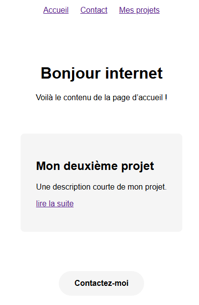

# Créer un portfolio avec Hugo et Netlify - Partie 3

Dans cette troisième partie, nous allons mettre en place des projets pour notre portfolio. Commençons par nous rendre dans le dossier `content`, et ajoutons un dossier avec le nom de votre choix, pour le tutoriel, nous allons créer le dossier `projets`. Ce nom sera celui utilisé par Hugo pour déterminer le `type` de ces projets. On ajoute ici un fichier `_index.md` afin de définir des informations générales. Pour le moment, il peut simplement contenir le titre de la page :

```markdown
---
title: "Mes projets"
--- 
```

Ajoutons ensuite deux projets, sous le forme de dossier avec les noms que l'on souhaite donner à nos projets (pas d'espaces ni de caractères spéciaux). Dans chacun de ces dossiers, on ajoute un fichier markdown `index.md` avec le contenu. Voilà un exemple simple de projet : 

```markdown
---
title: Mon premier projet
date: 2025-01-01
description: Une description courte de mon projet.
type: projets
---
Lorem ipsum dolor sit amet, consectetur adipiscing elit. Quisque mollis risus ut magna fermentum, sed porttitor justo scelerisque. Vestibulum ante ipsum primis in faucibus orci luctus et ultrices posuere cubilia curae; Phasellus vel varius libero. Suspendisse sed eros nunc. Mauris suscipit risus luctus nisi gravida, ac consequat ipsum efficitur. Nam feugiat lectus mauris, at pretium risus interdum nec. Nullam a ultricies diam. Duis tempor volutpat purus, quis condimentum mi elementum sit amet. Aenean et felis quis tellus tempus pellentesque nec et lacus. Etiam lobortis, quam in luctus congue, neque eros malesuada turpis, a egestas felis magna vitae lectus. In arcu orci, malesuada quis condimentum eu, posuere vel mi. Nullam dictum aliquam augue, nec dignissim diam porttitor quis. Fusce interdum sem dignissim augue tincidunt volutpat. Suspendisse potenti. Donec tempor accumsan augue vestibulum finibus.
```

Nous avons définit dans le `FrontMatter` le type de la page comme un `"projets"`, ce qui reprend le nom du dossier parent.

Pour le moment, la structure de nos projets ressemble à cela : 


Pour mettre en page nos projets, nous devons ensuite créer deux nouveaux fichiers de template dans `layouts > _default`. Commençons par `section.html`, il récupère tous les projets et les affichent dans une liste. 

```go-template
{{ define "main" }}
    {{ .Content }}
    {{ range where .Site.RegularPages "Type" "projets" }}
        <h2><a href="{{ .RelPermalink }}">{{ .LinkTitle }}</a></h2>
    {{ end }}
{{ end }}
```

Nous réutilisons la fonction `range` que nous avons vu dans la partie précédente, et nous récupèrons les pages stockées dans la variable globale `Site`, tant que celles-ci sont de types `"projets"`. On laisse ici le tri des pages par défaut, mais il existe [plusieurs autres méthodes](https://gohugo.io/methods/pages/).

Pour voir le résultat, ajoutez un onglet dans le menu (via le fichier `Hugo.toml`) de la manière suivante : 

```toml
  [[menus.header]]
    name = 'Mes projets'
    url = '/projets'
    weight = 30
```

Un nouvel onglet est créé, et la page `Mes projets` récupère bien tous les projets que nous venons d'ajouter dans le site, avec un lien vers chaque pages. 


Pour le moment, le site n'a pas de template pour afficher les projets unique, il faut donc le créer. C'est le rôle du fichier `single.html`. Voici une version sommaire de ce template :

```go-template
{{ define "main" }}
<article>
  <h1>{{ .Title }}</h1>
  {{ .Content }}
</article> 
{{ end }}
```

Maintenant, si vous cliquez sur un des projets, le contenu est correctement affiché :


Pour l'exercice, essayez de créer un partial afin d'afficher le dernier projet sur votre page d'accueil. Vous trouverez la solution juste après, mais prenez le temps d'essayer vous même, pour vous faire la main avec le fonctionnement d'Hugo.

**Une solution :**

Dans `layouts > partials`, créez un fichier `html` avec le contenu suivant : 

```go-template
<section>
    {{ range where .Site.RegularPages "Type" "projets" | first 1 }}
    <article>
        <h2>{{ .Title }}</h2>
        <p>{{ .Description }}</p>
        <p><a href="{{ .RelPermalink }}">lire la suite</a></p>
    </article>
    {{ end }}
</section>
```

Ce fichier est très similaire au template `section.html`, à la différence qu'il récupère seulement le premier projet de la liste avec la fonction `first`, le chiffre à la suite détermine le nombre à afficher. Si nous avions indiqué `| first 1`, alors la fonction aurait affiché les trois premières pages trouvées. 

Pour que la description du projet ne soit pas vide, il faut l'ajouter dans le `FrontMatter` de la manière suivante : 

```markdown
---
title: "Mon premier projet"
type: "projets"
description : "Une description courte de mon projet."
--- 
```

Il ne reste plus qu'a appeler le partial dans la page d'accueil, en passant par `home.html` : 

```go-template
{{ define "main" }}
    {{ .Content }}
    {{ partial "previewProjet.html" . }}
    <a href='/contact' class="btn">Contactez-moi</a>
{{ end }}
```

> Le lien vers la page d'accueil est maintenant dans le template de la page d'accueil et plus dans le fichier `_index.html` contenant le contenu de la page. C'est plus logique et plus stable dans ce cas.

Et voilà, le dernier projet s'affiche bien !



---

En résumé, dans cette troisième partie, nous avons mis en place la structure de nos projets, puis avons créé deux projets d'exemple. Nous avons aussi pris le temps d'ajouter le projet le plus récent à notre page d'accueil. Avec ce que nous avons vu jusque là, vous avez une base solide pour créer un portfolio sur Hugo. Prenez le temps de mettre en forme votre contenu, puis de mettre en forme notre site.

Dans la [partie suivante](), nous allons voir comment mettre en ligne notre portfolio avec Github et Netlify.