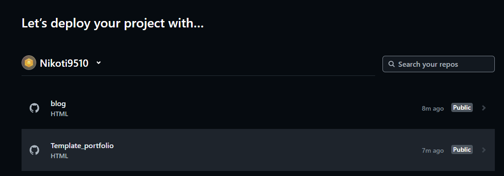
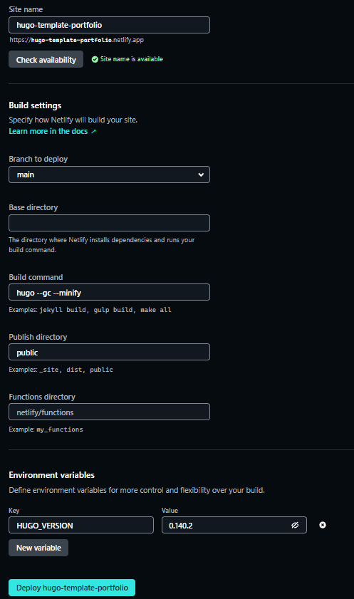
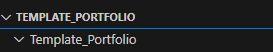
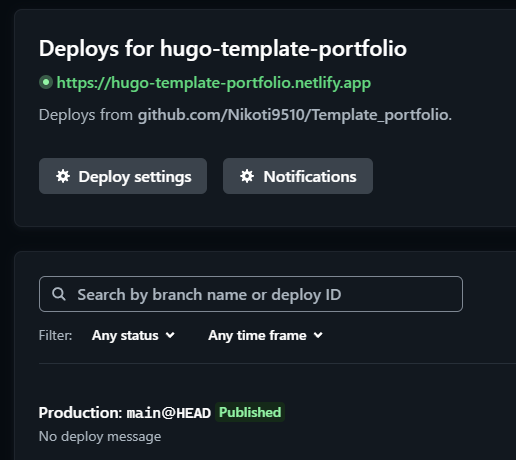

# Créer un portfolio avec Hugo et Netlify - Partie 4

Pour commencez, rendez-vous sur [Netlify](https://app.netlify.com/) et connectez vous à votre compte. Ensuite, rendez-vous dans la page `Sites` de votre espace personnel, puis cliquez sur `Add new site`. 

Choisissez l'option `import an existing project`, puis choisissez GitHub. Connectez vous alors avec votre compte personnel GitHub, et une fois cela fait, choisissez le répertoire utilisé pour stocker votre projet.

> Si votre répertoire ne s'affiche pas, suivez [les étapes de ce tutoriel proposé par Hugo](https://gohugo.io/hosting-and-deployment/hosting-on-netlify/) à partir de l'étape 4.

Une fois le répertoire choisit, vous devez compléter quelques paramètres. 

1. **Site name** : Il doit être unique,
2. **Branch to deploy** : Laissez sur `main` par défaut,
3. **Build command** : Ajoutez la commande suivante : `hugo --gc --minify`,
4. **Publish directory** : Si ce n'est pas complété, ajoutez `public`,
5. Enfin, cliquez sur le bouton **Add environment variables**, puis dans **Key** ajoutez `HUGO_VERSION`. Dans **Value** ajoutez le numéro de [la dernière version de Hugo](https://github.com/gohugoio/hugo/releases/latest), à la création de cet article, c'est `0.140.2`.

Cliquez ensuite sur `Deploy` en bas de la page. Netlify va alors prendre un peu de temps pour mettre en ligne votre site. Il se peut que votre installation ne fonctionne pas. Dans ce cas, assurez vous que vous avez bien lancé l'installation depuis la racine de votre projet. Si votre racine n'est pas au même niveau que le répertoire GitHub, alors il faut ajouter le chemin dans la configuration Netlify, au niveau de **Base directory**. 

Dans le Screenshot précédent, on voit que le répertoire GitHub est nommé `TEMPLATE_PORTFOLIO`, et la racine du projet `Template_Portfolio`. *C'est une mauvaise idée, ne faites pas ça*. Il faut dans ce cas définir `Base directory = Template_Portfolio` dans la configuration de Netlify.

Le site une fois construit, Netlify indique bien le tag `Published` :

Il ne vous reste plus qu'a consulter votre site en ligne ! En quelque minute et en suivant le [pas à pas fournit par la documentation de Hugo](https://gohugo.io/host-and-deploy/host-on-netlify/), il nous est possible d'avoir un site de test gratuit afin de partager notre travail sur le web.  