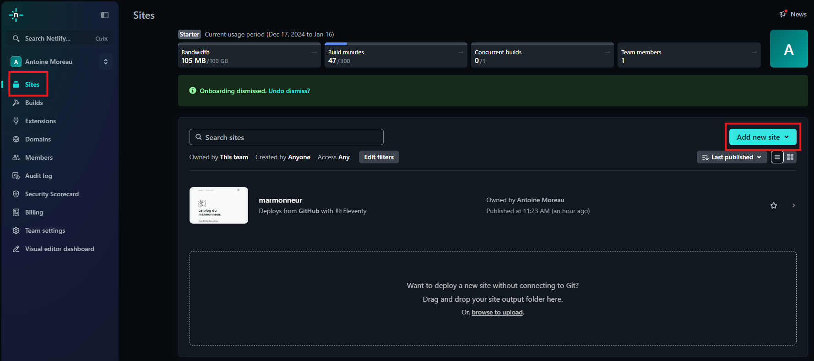
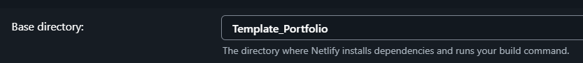

# Mettre notre site en ligne avec Netlify


Avant de continuer, assurez vous d'avoir poussé vos dernières modifications sur Github. Une fois cela fait, créez vous un compte sur [Netlify](https://app.netlify.com/). Ensuite, rendez-vous dans la page `Sites` de votre espace personnel, puis cliquez sur `Add new site`. 





Choisissez l'option `import an existing project`, puis choisissez GitHub. Connectez vous alors avec votre compte personnel GitHub, et une fois que c'est fait, choisissez le répertoire utilisé pour stocker votre projet.


> Si votre répertoire ne s'affiche pas, suivez [les étapes de ce tutoriel proposé par Hugo](https://gohugo.io/hosting-and-deployment/hosting-on-netlify/) à partir de l'étape 4.


Une fois le répertoire choisit, il faut compléter quelques paramètres. 


1. **Site name** : Il doit être unique, testez la disponibilité,
2. **Branch to deploy** : Laissez sur `main` par défaut,
3. **Build command** : Ajoutez la commande suivante : `hugo --gc --minify`,
4. **Publish directory** : Si ce n'est pas complété, ajoutez `public`,
5. Enfin, cliquez sur le bouton **Add environment variables**, puis dans **Key** ajoutez `HUGO_VERSION`, et dans **Value** ajoutez le numéro de [la dernière version de Hugo](https://github.com/gohugoio/hugo/releases/latest), à la création de cette article, c'est `0.140.2`.


Cliquez ensuite sur `Deploy` en bas de la page. Netlify va alors prendre un peu de temps pour mettre en ligne le site. Il se peut que votre installation de fonctionne pas, dans ce cas, assurez vous que vous avez bien lancé l'installation depuis la racine de votre projet. Si votre racine n'est pas au même niveau que le répertoire GitHub, alors il faut ajouter le chemin dans la configuration Netlify, au niveau de **Base directory**. 





Dans le screenshot précédent, on voit que dans VScode, j'ai mon répertoire GitHub avec le nom `TEMPLATE_PORTFOLIO`, et la racine de mon projet dans un dossier appelé `Template_Portfolio` (c'est une mauvaise idée, ne faite pas ça). Il faut donc que je définisse `Base directory = Template_Portfolio` dans la configuration de Netlify.


Le site une fois construit, vous aurez ce message :


Il ne reste plus qu'a consulter votre superbe site en ligne !

---

## Installer le CMS


On va commencer par ajouter dans notre projet la page d'administration du CMS. Dans `static`, créez un dossier `admin` dans lequel il faut insérer les fichiers `index.html` et `config.yml`. 


`index.html` : 


```html
<!DOCTYPE html>
<html>
  <head>
    <meta charset="utf-8" />
    <meta name="viewport" content="width=device-width, initial-scale=1.0" />
    <title>Content Manager</title>
  </head>
  <body>
    <!-- Include the script that builds the page and powers Decap CMS and sveltia CMS-->
    <script src="https://unpkg.com/@sveltia/cms/dist/sveltia-cms.js"></script>
  </body>
</html>
```


`config.yml` : 


```yml
backend:
  name: github
  repo: COMPTE GITHUB/REPO # C'est le nom de votre répertoire github
  branch: main # Branch to update (optional; defaults to master)
media_folder: Template_Portfolio/static/media
public_folder: /media


collections:
  - name: 'Projets'
    label: 'Projets'
    label_singular: 'Projet'
    folder: '/Template_Portfolio/content/projets' # Le chemin depuis la racine du site, à adapter selon votre projet
    path: '{{slug}}/index'
    media_folder: ''
    public_folder: ''
    slug: '{{day}}-{{month}}-{{year}}-{{slug}}'
    create: true
    editor:
      preview: false
    fields:
      - { label: 'Titre', name: 'title', widget: 'string' }
      - { label: 'Date', name: 'date', widget: 'datetime', date_format: "DD.MM.YYYY", time_format: "HH:mm"}
      - { label: 'Description', name: 'description', widget: 'string' }
      - { label: 'Type', name: "type", widget: 'string'}
      - { label: 'Contenu', name: 'body', widget: 'markdown' }
```


le fichier `index.html` est simplement la page statique de notre pannel d'administration. Il appelle un script qui charge toutes les fonctionnalitées proposés par Sveltia. 

Le fichier `config.yml` quant à lui, définit les paramètres de sécurités de notre backend ainsi que la structure des pages que l'on souhaite pouvoir retrouver dans le CMS. C'est ici que l'on fait le lien entre le FrontMatter des fichiers `.md` et notre CMS.

Une fois cela fait, poussez vos ajouts sur GitHub. Cependant, le CMS n'est pas encore tous à fait accessible, il faut gérer les autorisations. En effet, pour éviter que d'autres personnes puissent accéder à votre panel d'administration, il est nécessaire de faire le lien entre Netlify, le CMS et GitHub. On va donc mettre en place une sécurité afin de pouvoir se connecter via notre compte GitHub.


Pour cela, il faut se rendre dans les [paramètres de votre compte GitHub](https://github.com/settings/profile), puis tout en bas dans `Developer Settings`. Cliquez ensuite sur `OAuth Apps` : 


Dans cette page, cliquez sur `Register a new application`, et la fenêtre suivante va s'ouvrir : 


Il faut compléter les informations comme suit : 


1. **Application name** : Un nom de votre choix,
2. **Homepage URL** : C'est l'url de votre site en ligne, que vous pouvez retrouver dans l'espace du site sur Netlify,
3. **Authorization callback URL** : Il faut lui donner la valeur `https://api.netlify.com/auth/done`.


Une fois fait, cliquez sur `Register application`. GitHub vous ouvre alors la page de votre application, où vous pouvez voir son `Client ID`. Copiez le dans un coin, car on va en avoir besoin pour la prochaine étape. Il faut également générer un clé client, pour cela, cliquez sur `Generate a new client secret`.


Copier bien la clée généré par GitHub dans un coin également, car il ne sera pas possible de la retrouver plus tard. Maintenant que c'est fait, il ne nous reste plus qu'a faire le lien entre GitHub et Netlify. Pour cela, rendez-vous dans le dashboard de votre site sur Netlify, puis naviguez dans `Site configuration > Access & security > OAuth`. Sous `Authentication providers`, cliquez sur `Install provider`. 


Sélectionnez ensuite GitHub, et complétez les deux clées avec celles que vous avez générées un peu plus tôt :


Enfin, il ne vous reste plus qu'a cliquer sur `Install`, et le tour est joué ! Maintenant, il vous est possible d'accéder à votre backoffice en ajoutant `/admin` à la suite de l'url de votre site en ligne. Il vous faudra vous identifier avec votre compte GitHub. 


Vous êtes maintenant prêt pour ajouter du contenu à votre site à distance. À chaque mise à jour, le CMS va pousser les modifications sur le répertoire GitHub, et Netlify relancera la construction du site. Il n'y a rien à faire, quelques instants après avoir publié du contenu, il sera automatiquement en ligne. 


> Ressource utile pour cette section : 
> * <https://github.com/sveltia/sveltia-cms/?tab=readme-ov-file#getting-started>
> * <https://decapcms.org/docs/hugo/>
> * <https://decapcms.org/docs/github-backend/>
> * <https://docs.netlify.com/security/secure-access-to-sites/oauth-provider-tokens/#using-an-authentication-provider>


Je vous laisse faire le tour du CMS par vous même, c'est une interface graphique assez simple, vous devriez vous en sortir.

J'espère que vous avez tout compris. Intéro surprise, montrez moi vos portfolios :mortar_board: