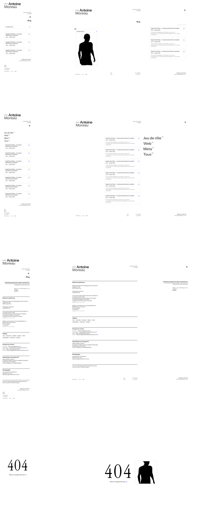

# Création de mon portfolio - inspirations, méthode et ressources 
J'ai cherché pendant un long moment quel style choisir pour mon portfolio. J'ai passé des dizaines d'heures sur [awwwards](https://www.awwwards.com/websites/nominees/), [onepagelove](https://onepagelove.com/), [godly](https://godly.website/), [deadsimplesites](https://deadsimplesites.com/), Pinterest et Dribbble à la recherche du design parfait. Après de nombreux aller retour, des prototypes foireux et beaucoup de remise en question, je me suis arrêté sur les douze sites suivants pour définir mon design : 
- [https://bravoure.nl/en](https://bravoure.nl/en)
- [https://www.instrument.com/](https://www.instrument.com/)
- [https://www.henninglarsen.com/](https://www.henninglarsen.com/)
- [https://www.stewartpartners.studio/](https://www.stewartpartners.studio/)
- [https://www.antinomy.studio/](https://www.antinomy.studio/)
- [https://gavinatkinson.com/](https://gavinatkinson.com/)
- [https://donprod.uk/](https://donprod.uk/)
- [https://www.juliajohnson.com/](https://www.juliajohnson.com/)
- [https://gregorylalle.com/about](https://gregorylalle.com/about)
- [https://gmaurovich.com/](https://gmaurovich.com/)
- [https://designembraced.com/](https://designembraced.com/)
- [https://www.alejandromejias.com.au/](https://www.alejandromejias.com.au/)

Je voulais trois choses pour mon portfolio. Une page d'accueil sans scroll avec un sens de lecture circulaire, un design minimaliste et brutaliste, et une lecture agréable des contenus. Avec ces idées en tête et mes sites d'inspirations, je me suis lancé dans le prototypage. D'abord sur papier, parfois dans Codepen ou dans un environnement de test pour m'assurer de la faisabilité d'une idée. Ensuite sur [Penpot](https://penpot.app/) pour définir la structure plus en détail. Cet outil permet de mettre en place des layout Flex et Grid directement lors de la création graphique, ce qui c'est avéré très utile lors de l'intégration. 

## Méthode, ou l'absence de
Ce qui m'a causé la plus grande perte de temps lors de la création de mon portfolio, c'est mon manque d'organisation. En plus de découvrir les outils (Penpot, Hugo, ThreeJS, Netlify, etc..) que je n'avais jamais utilisé, je découvrais aussi la réalité de créer un site en partant de zéro. J'ai fais beaucoup d'aller retour et de faux départ avant d'en arriver à la maquette présenté plus haut. 

Pour mon prochain site, il faut que je me tienne à une structure plus rigide. Faire une phase de recherche graphique et de prototypage complète avant de toucher au code. Il faut que chaque page, chaque élément, chaque texte soient écrit et définit avant de commencer à intégrer. Que chaque couleur et élément graphique soient réfléchit et définitivement choisit. Il faut aussi que j'adapte les outils en fonction des besoins, et que le choix soit fait après la phase de recherche.

J'ai hésité, en plein milieu de l'intégration du site, à changer de Framework. Mais je suis heureux de ne pas l'avoir fait, car même s'il y a d'autres outils très performant, sans doute même meilleur qu'Hugo, j'aurais perdu beaucoup de temps à passant sur Astro ou Svelte. Au moins maintenant, je connais un peu mieux Hugo, et je suis capable de savoir dans quel domaine il excelle, et dans lesquels il est moins adapté. 

## Le modèle 3D 
Un élément important que je voulais intégrer était un modèle 3D basé sur mon visage. Pour le créer, j'ai d'abord réalisé un avatar via le site [avaturn.me](https://avaturn.me/), que j'ai ensuite importé dans [blender](https://www.blender.org/) pour supprimer les textures prédéfinit et (*essayer d'*) optimiser le modèle. Une fois cela fait, j'ai importé le modèle dans le site en utilisant [threejs](https://threejs.org/). (Cette vidéo m'a bien aidé : [Loading Models (using Three.js) - Both Static and Animated! (via Youtube)](https://www.youtube.com/watch?v=8n_v1aJmLmc)). J'ai associé au modèle une animation trouvée dans la librairie d'animation libre de droit [Mixamo](https://www.mixamo.com/#/?page=1&query=looking&type=Motion%2CMotionPack). (Gratuit, libre de droit et qui appartient à Adobe, allez savoir). Après quelques passages de filtre et shaders, l'effet est plutôt satisfaisant. 

<video controls width="100%" height="400">
  <source src="model_noaudio.mp4" type="video/mp4" />
</video>

Mais, parce qu'il faut bien un mais quelque part dans cette histoire, impossible de faire charger le modèle convenablement dans mon site. Quoi que je fasse, l'ajout du modèle cause toujours un "freeze" du navigateur pendant quelques centaines de millisecondes. Je me suis donc résolu à déplacer le modèle dans une page peu visitée du site. (Je vous laisse le retrouver, ça ne devrait pas être trop compliqué).

## Autres ressources
Pour le reste du site, le principal problème rencontré est du à Hugo. Le fait que je ne connaisse pas le [Go](https://go.dev/) m'a énormément compliqué la vie, toutes actions qui me prendrais moins de cinq minute à réaliser en Javascript me prenant parfois plusieurs heures. Cela dit, [la documentation de Hugo](https://gohugo.io/documentation/) et les nombreux posts dans les forums de la communauté m'ont permit de pas trop mal m'en sortir. 

Autres ressources utiles en vracs :
- [Web.dev/articles/building/a-theme-switch-component](https://web.dev/articles/building/a-theme-switch-component) et [whitep4nth3r.com/blog/best-light-dark-mode-theme-toggle-javascript/](https://whitep4nth3r.com/blog/best-light-dark-mode-theme-toggle-javascript/) pour la gestion du thème de couleur du site.
- [Google-webfonts-helper](https://gwfh.mranftl.com/fonts/inter?subsets=cyrillic,cyrillic-ext,greek,greek-ext,latin,latin-ext,vietnamese), [modernfontstacks](https://modernfontstacks.com/) et [https://typescale.com/](https://typescale.com/) pour la typographie.
- Le reset CSS d'Andy Bell sur [piccalilli](https://piccalil.li/blog/a-more-modern-css-reset/).
- [Markdownguide](https://www.markdownguide.org/cheat-sheet/) pour la syntax du markdown
- La chaine Youtube de [Kevin Powell](https://www.youtube.com/@KevinPowell/videos), même s'il n'y a plus besoin de le présenter.

Voilà, c'est l'histoire de mon Portfolio. Y'a encore du boulot.