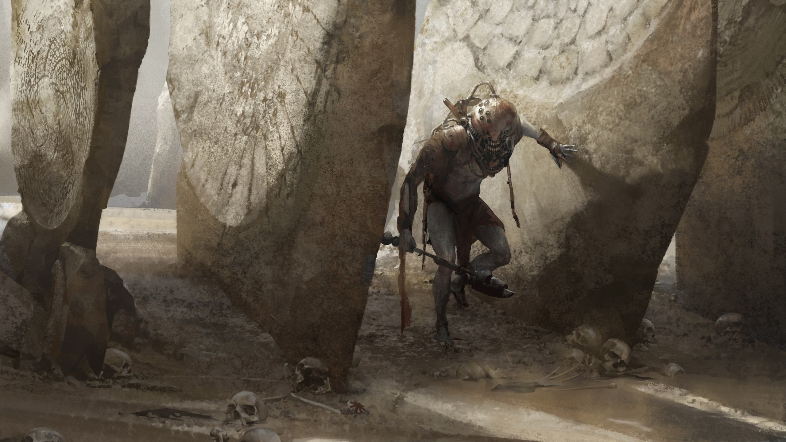

# Degenesis - Stèles d'échos
Il y a quelque temps j'ai découvert le blog Mindstorm avec le post [nested-monster-hit-dice](https://www.mindstormpress.com/nested-monster-hit-dice). Tyrell, l'auteur du site, nous présente une méthode de création et d'interprétation des monstres qui vise à renforcer les piliers du jeu OSR, à savoir la prise d'information et de décision des joueurs face aux problèmes proposés par le maître du jeu.

Selon lui, cet aspect n'est pas assez exploité lors de la phase de combat, qui se résume trop souvent par quelque chose comme : *"Je lance mon dé d'attaque, je touche et applique mes dégâts. Au suivant !"*. Il nous propose donc de segmenter les adversaires en sous ensembles d'éléments, chacun possédant des caractéristiques particulières. L'idée étant de présenter les adversaires en fonction de ce que peuvent percevoir les personnages de nos joueurs, et que certains aspects restent cachés jusqu'à leurs utilisations lors du combat.

De cette façon, les joueurs peuvent prioriser certains points vitaux ou stratégiques de l'adversaire, prendre le temps de se renseigner en amont sur un ennemi pour apprendre et se préparer à l'avance, ou encore fuir un combat déséquilibré pour revenir mieux équiper et prendre leur revanche. Tout cela est bien évidemment possible sans ce système, mais celui-ci permet de le rendre organique et très simple à mettre en place pour le maître du jeu. Je vous invite grandement à lire l'article de Mindstorm, car il explore d'autres avantages à cette méthode.

Personnellement, j'utilise ce système dès que je veux proposer un affrontement qui sort de l'ordinaire à mes joueurs. Je ne pense pas en effet qu'il soit adapté pour tous les combats dans lesquels vos joueurs vont se retrouver. Un loup galeux ne présente pas un intérêt suffisant pour en détailler les mécaniques outre mesure, alors  qu'une Cocatrix traumatisant les vallons alentours depuis des semaines, oui.

J'avais envie d'écrire un peu pour le jeu [Degenesis](https://degenesis.com/), et je me suis dit que ça serait un bon prétexte pour illustrer la manière dont j'utilise la méthode de Mindstrom, tout en découvrant un peu les Balkans, que je n'ai pas encore eu l'occasion d'explorer en jeu avec mes joueurs.  

## Le lien
Le tonnerre gronde au loin, les nuages sombres roulent sur les flancs de basaltes abrupts. Les grosses gouttes humidifient les étranges stèles d'échos qui percent les escarpements, entre les saillies rocheuses et les conifères. L'eau ruisselle et de curieux reflets apparaissent sur les faces encore illuminées par les derniers rayons de soleil. La brume déjà lourde nappe le fond de la vallée, et les stèles la transpercent, comme de multiples ailerons de squales, tournant autour du champ de spore mère caché sous les nappes de brouillards.

## Les antagonistes
Trois Dushani, des Lesnje, protègent le champ de spore. Ils sont entièrement nus, leurs peaux sont pâles et sales. Leurs pieds et mains griffus sont contusionnés et couverts d'hématomes. Leurs visages sont masqués sous des scaphandres de métal noir, d'où dépassent des dents pointues et luisantes. Les casques sont posés sur leurs épaules, et des dizaines de câbles et tuyaux en sortent, dansant comme les membres indépendants d'un céphalopode. L'un est assis au centre du champ de spore, ses mains ondulent au-dessus de sa tête. Les deux autres marchent entre les stèles autour du cratère, formant volutes et tourbillons dans les brumes à leurs passages.  

## Le groupe
* *Rika Wittwer - Hellvétique - Grenadière*\
  Elle rampe dans la mousse grasse et humide derrière un monticule rocheux. Chaque mouvement est calme et mesuré. Son tympan droit lui fait mal et du sang séché colle ses cheveux court à son casque radio. Elle vérifie encore une fois la sécurité de son lance-grenade. Son harnais de reconnaissance est maculé de terre. Encore quelques mètres, et elle sera en position, juste sous cette grande stèle.
* *Elman - Blafard - Solaire*\
  Les dents d'Elman vibrent, il ressent la matrice sonore à travers ses pieds nus. Il avance vers le champ de spore, passant devant les séries de stèles d'échos. Les Lesnjes l'ont repérés depuis un moment déjà, ils l'écoutent. Sa bouche est sèche à force de parler, de crier, ses paroles chargées de double sens mnémétiques, frappant les cerveaux instinctifs des aberrants et les tenants à l'écart.   
* *Mara - Jehammétanne - Daliha*\
  Les cheveux couleurs ébène de Mara dansent devant ses yeux. Elle suit le blafard comme son ombre, le talisman de sa mère est niché au creux de sa main. Le chant d'Elman résonne dans sa poitrine, mais elle ne l'écoute pas. Elle se focalise sur la rage, le bouillonnement qui grandit. Les phalanges de sa main libre blanchissent alors qu'elle saisie son cimeterre. 
* *Benedikt Kohl - Spitalier - Préserviste*\
  Épée préservalis en avant, Benedikt transperce la brume dans un silence de mort. Elman et Mara sont sur l'autre versant. Il enjambe les obstacles avec une précision chirurgicale. Les premiers filaments de mycélium s'accrochent à ses bottes. Le talc sur son crâne chauve vibre et ondule. Un Lesnje s'est retourné, la diversion a fait son œuvre, à lui de faire le sien. Il lui reste encore trente mètres, il accélère. Les premiers mots tribaux atteignent son esprit, les enseignements de Krangler retentissent dans son esprit. Il avance, inflexible. 

## Compétences et statistiques
***Lesnje*** : \
*Veux* : Protéger le champ de spore mère et l'harmonie de la matrice sonore. \
*Rage* : Bruits dissonants\
*Peur* : Perdre son masque

| Compétence | Valeur |
|---|---|
| Instinct | 8d |
| Psyché | 6d |
| Agilité | 5d |
| Physique | 7d |
| Intellect | 4d |
| Charisme | 4d |
| Défense passive | 3d |

* **Scaphandre** : *(25HP | 3 Armures)* \
  Ajoute +4d pour percevoir l'environnement dans un rayon de 100 mètres autour du Lesnje
  * 👁️ *Jet d'encre :*\
    Les câbles du scaphandre projettent un écran d'encre qui flotte dans l'air vibrant et obscurcit la vision. +2d à la défense passive pour 1 tour.
  * 🤎 *Parasite : (10HP)*\
    Le kraken a percé le crâne de son hôte, il frémit sous la lumière du jour, et la peur se lit dans ses yeux brillants et noirs.
* **Stèles d'échos** : *(50HP | 4 Armures)* 
  * ⚡ *Résonance : (tant que les stèles sont intactes)*\
    Tant que les stèles sont debout, elles amplifient la matrice sonore et appliquent un malus de -2D aux attaquants. 
  * 🏹⚡ *Onde sonore : (au moins 2 Lesnjes encore en vie)*\
    Les Lesnjes harmonisent leurs chants pour former une onde sonore infligeant 1d6+2 traumatismes. 
* **Cisailles** : *(8HP | 1 Armures)* \
  Le Lesnje porte à la main une cisaille rouillée mais particulièrement menaçante. Elle est fixée à sa main par un assemblage de cordes et de câbles. 
  * *🗡️Empalement :* Inflige 1d6+2 blessures superficielles.

--- 

> 🤎 : Point vital de l'adversaire, c'est lui qui doit être détruit pour vaincre l'adversaire. \
> 👁️ : Cet élément n'est pas visible. Les joueurs peuvent apprendre son existence en se renseignant à l'avance, ou à leur dépens pendant l'affrontement.\
> ⚡ : Compétence spéciale de l'adversaire. \
> 🏹 : Attaque à distance.\
> 🗡️ : Attaque en corps à corps.